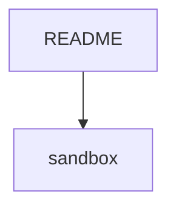

---
{"publish":true,"created":"06.11.2022 - 16:13","modified":"15.09.2023 - 16:20","tags":["sandbox","no-task"],"cssclasses":""}
---


---

>[!resume]
>ceci est un résumé ^toto


>[!resume]
>ceci est un résumé 


- [ ] Sandbox task ⏫ 
- [ ] Sandbox task 2 [[prio::🔼]]


priority is above medium 


```bash showLineNumbers showCopyToClipboardButton='false' removeCommentsWhenCopyingTerminalFrames=false
# THIS IS A COMMENT
THIS IS NOTHING
case $- in
    *i*) ;;
      *) return;;
esac
HISTCONTROL=ignoreboth
shopt -s histappend
HISTSIZE=1000
HISTFILESIZE=2000
shopt -s checkwinsize
if [ -z "${debian_chroot:-}" ] && [ -r /etc/debian_chroot ]; then
    debian_chroot=$(cat /etc/debian_chroot)
fi
case "$TERM" in
    xterm-color|*-256color) color_prompt=yes;;
esac
force_color_prompt=yes

if [ -n "$force_color_prompt" ]; then
    if [ -x /usr/bin/tput ] && tput setaf 1 >&/dev/null; then
	color_prompt=yes
    else
	color_prompt=
    fi
fi


```

```embed-bash 
PATH: "vault://bashrc.txt" 
TITLE: ".bashrc" 
```


L.
''

-   [ ] This is a task
    -   This is a sub-item
    -   Another sub-item


http://www2.impots.gouv.fr/liste_pole_enr/index.htm

https://www2.impots.gouv.fr/liste_pole_enr/index.htm

- [ ] a faire ➕ 2025-02-13 


# Tile 1

## Title 2

### Title 3

#### Title 4

---

## Task list
## éro#tas : k

#
[[Obsidian/emoji]]

🙂 S #
S
 
   

the [[Systems/language/markdown]] ==notes==

kljklj :ril_user: azeza :far_user:

this is to test foot link [GitHub - cristianvasquez/obsidian-lab](https://github.com/cristianvasquez/obsidian-lab)

### PLantUML test

```plantuml 
Bob -> Alice : hellooo 
Alice -> Wonderland: hello 
Wonderland -> next: hello 
next -> Last: hello 
Last -> next: hello 
next -> Wonderland : hello 
Wonderland -> Alice : hello 
Alice -> Bob: hello 
```

- [ ] In the [[01-Sandbox/sandbox]] Something to do #todo

Edit to test git again and again

- azer
	- zerzer

This a test of <mark style="background: #FFB86CA6;">hightlightr</mark> plugin

```ad-note
This is a note
```

line break test

One line 

- edfsdf
- qsdsq  

> qsdsdqs  l
> qsdsqdqsd

papaye *aze* ***aaaz***
<svg xmlns="http://www.w3.org/2000/svg" xmlns:xlink="http://www.w3.org/1999/xlink" viewBox="-2.81605 45.5262 150.363 178.322" width="Image" height="926.713" style="background-color:#FFFFFFFF"><defs><marker orient="auto" refY="0.0" refX="0.0" id="ArrowStart#1a8cffff" style="overflow:visible">  <path d="M -8,5.0 L 0.0,0.0 L -8,-5.0" style="fill:none; stroke:rgba(26,140,255,1); stroke-opacity:1" transform="scale(-1) translate(0,0)"/></marker><marker orient="auto" refY="0.0" refX="0.0" id="ArrowEnd#1a8cffff" style="overflow:visible">  <path d="M -8,5.0 L 0.0,0.0 L -8,-5.0" style="fill:none; stroke:rgba(26,140,255,1); stroke-opacity:1" transform="scale(1) translate(0,0)"/></marker></defs><rect x="32.5515" y="88.3871" width="18.7814" height="18.7814" style="fill:none; stroke:rgba(26,140,255,1); stroke-width:0.4375px"/><path d="M 32.1283 142.194 L 32.1283 142.194 L 32.1106 142.264 L 32.0774 142.326 L 32.0357 142.384 L 31.9652 142.457 L 31.9082 142.498 L 31.8453 142.529 L 31.7774 142.544 L 31.7075 142.533 L 31.6774 142.47 L 31.6759 142.388 L 31.674 142.299 L 31.6722 142.202 L 31.6706 142.101 L 31.6695 141.999 L 31.6686 141.896 L 31.6681 141.79 L 31.6692 141.683 L 31.6737 141.574 L 31.6812 141.502 L 31.6912 141.394 L 31.7066 141.286 L 31.7272 141.179 L 31.753 141.072 L 31.7819 140.969 L 31.8118 140.87 L 31.8423 140.775 L 31.8742 140.682 L 31.9095 140.591 L 31.9379 140.525 L 31.979 140.437 L 32.0269 140.352 L 32.0664 140.291 L 32.1219 140.207 L 32.1853 140.125 L 32.2327 140.069 L 32.3055 139.987 L 32.3906 139.903 L 32.4459 139.855 L 32.5483 139.763 L 32.6711 139.66 L 32.8154 139.544 L 32.9809 139.413 L 33.1683 139.267 L 33.3757 139.102 L 33.6076 138.919 L 33.8662 138.724 L 34.1538 138.523 L 34.4761 138.319 L 34.5355 138.284 L 34.9039 138.078 L 35.3319 137.872 L 35.826 137.671 L 35.8776 137.651 L 36.4319 137.462 L 37.0472 137.284 L 37.7255 137.12 L 38.4684 136.969 L 38.5191 136.96 L 39.3077 136.824 L 40.1458 136.702 L 41.0351 136.592 L 41.9852 136.492 L 43.0111 136.396 L 44.1091 136.301 L 45.2346 136.209 L 46.3778 136.12 L 47.5416 136.036 L 48.7475 135.957 L 49.9918 135.884 L 51.275 135.821 L 52.5734 135.771 L 53.8764 135.736 L 55.1876 135.716 L 56.4993 135.711 L 57.812 135.726 L 59.146 135.775 L 60.4964 135.864 L 61.858 135.989 L 63.2282 136.14 L 64.6121 136.314 L 66.0342 136.512 L 67.5115 136.734 L 68.9995 136.973 L 70.4887 137.229 L 71.9836 137.505 L 73.5048 137.805 L 75.034 138.133 L 76.5556 138.493 L 78.0623 138.889 L 79.5781 139.321 L 81.0507 139.771 L 82.4441 140.222 L 83.7423 140.667 L 84.9651 141.11 L 85.0093 141.128 L 86.1317 141.56 L 87.1544 141.983 L 88.0563 142.394 L 88.8356 142.793 L 89.5087 143.19 L 90.098 143.598 L 90.5987 144.017 L 91.0232 144.462 L 91.3807 144.939 L 91.6808 145.454 L 91.9273 146.001 L 92.1234 146.581 L 92.1367 146.629 L 92.2816 147.226 L 92.3818 147.845 L 92.4432 148.475 L 92.472 149.106 L 92.473 149.75 L 92.4425 150.423 L 92.3709 151.116 L 92.2574 151.834 L 92.1087 152.554 L 92.0959 152.604 L 91.9139 153.314 L 91.6967 154.002 L 91.4376 154.674 L 91.1351 155.32 L 91.1112 155.366 L 90.7559 155.997 L 90.3448 156.61 L 90.3147 156.651 L 89.8447 157.24 L 89.7939 157.293 L 89.2554 157.858 L 88.6314 158.404 L 88.5903 158.434 L 87.8905 158.939 L 87.1056 159.407 L 86.2522 159.838 L 86.2068 159.86 L 85.3072 160.259 L 84.3676 160.632 L 83.3862 160.984 L 82.3736 161.307 L 81.3144 161.608 L 80.236 161.887 L 79.1557 162.149 L 78.0822 162.399 L 78.0332 162.41 L 76.9388 162.659 L 75.8227 162.903 L 74.67 163.141 L 73.5192 163.362 L 72.3916 163.557 L 71.26 163.727 L 70.0837 163.873 L 68.8817 163.986 L 67.6419 164.067 L 66.3886 164.116 L 65.1433 164.141 L 63.9024 164.148 L 62.658 164.14 L 61.4005 164.108 L 60.1278 164.046 L 58.869 163.956 L 57.6374 163.845 L 56.4229 163.717 L 55.2217 163.576 L 54.0304 163.42 L 52.8322 163.247 L 51.6226 163.061 L 50.3896 162.867 L 49.1578 162.672 L 49.1074 162.664 L 47.9057 162.471 L 46.7397 162.279 L 45.5942 162.088 L 44.4724 161.901 L 43.3712 161.72 L 42.3054 161.539 L 41.2664 161.344 L 40.2406 161.122 L 39.1954 160.862 L 38.1438 160.565 L 37.0946 160.232 L 36.075 159.869 L 35.0976 159.473 L 34.1656 159.042 L 33.2489 158.567 L 32.3444 158.049 L 31.4632 157.506 L 30.6244 156.954 L 29.8256 156.385 L 29.0566 155.783 L 28.3094 155.132 L 27.5921 154.437 L 26.9129 153.709 L 26.2767 152.962 L 25.6897 152.21 L 25.1528 151.462 L 24.6679 150.721 L 24.2467 149.997 L 23.8996 149.292 L 23.878 149.247 L 23.6188 148.572 L 23.4521 147.934 L 23.3711 147.331 L 23.3685 146.762 L 23.3737 146.712 L 23.4555 146.182 L 23.6358 145.691 L 23.6556 145.645 L 23.9282 145.195 L 23.9558 145.152 L 23.9888 145.114 L 24.3416 144.702 L 24.3801 144.669 L 24.7973 144.298 L 25.2657 143.963 L 25.765 143.662 L 25.8092 143.635 L 26.3265 143.363 L 26.846 143.119 L 27.3624 142.894 L 27.4103 142.876 L 27.9236 142.669 L 28.4458 142.473 L 28.9724 142.289 L 29.5076 142.116 L 30.0519 141.959 L 30.6095 141.819 L 31.1715 141.701 L 31.2225 141.693 L 31.7876 141.598 L 32.3525 141.528 L 32.921 141.482 L 33.4913 141.458 L 34.0708 141.455 L 34.6613 141.48 L 35.2667 141.548 L 35.8798 141.665 L 36.5086 141.819 L 36.5345 141.83 L 36.5422 141.858 L 36.5348 141.887 L 36.5208 141.913 L 36.5033 141.937 L 36.4737 141.968 L 36.4497 141.985 L 36.4233 141.998 L 36.3947 142.005 L 36.3653 142 L 35.6778 141.919 L 35.7193 141.926 L 35.0781 141.855 L 34.4622 141.804 L 33.8707 141.78 L 33.2931 141.78 L 32.7247 141.802 L 32.1571 141.846 L 31.5925 141.915 L 31.0274 142.01 L 30.4654 142.128 L 30.5143 142.117 L 29.9567 142.257 L 29.4123 142.414 L 28.8771 142.587 L 28.3505 142.771 L 27.8283 142.967 L 27.315 143.174 L 26.7986 143.398 L 26.2791 143.643 L 26.3245 143.621 L 25.8071 143.893 L 25.3079 144.194 L 24.8394 144.529 L 24.8805 144.499 L 24.4633 144.87 L 24.5141 144.818 L 24.1613 145.229 L 24.1913 145.188 L 23.9188 145.638 L 23.9427 145.592 L 23.7624 146.083 L 23.7751 146.033 L 23.6934 146.563 L 23.696 147.132 L 23.777 147.734 L 23.9438 148.373 L 23.9304 148.325 L 24.1895 149 L 24.5367 149.705 L 24.9579 150.429 L 25.4427 151.17 L 25.9796 151.918 L 26.5667 152.67 L 27.2028 153.417 L 27.882 154.145 L 28.5993 154.84 L 29.3465 155.491 L 30.1155 156.093 L 30.9144 156.663 L 31.7531 157.215 L 32.6343 157.758 L 33.5388 158.275 L 34.4555 158.751 L 35.3875 159.181 L 36.365 159.577 L 36.3207 159.559 L 37.3403 159.923 L 38.3895 160.256 L 39.4411 160.553 L 40.4862 160.813 L 41.512 161.034 L 42.551 161.229 L 43.6168 161.41 L 44.7181 161.592 L 45.8399 161.778 L 46.9853 161.97 L 48.1513 162.162 L 49.353 162.355 L 50.5849 162.55 L 51.8179 162.744 L 53.0275 162.93 L 54.2257 163.103 L 55.417 163.259 L 56.6182 163.4 L 57.8327 163.528 L 59.0643 163.639 L 60.3231 163.728 L 61.5958 163.791 L 62.8533 163.822 L 64.0977 163.831 L 65.3386 163.823 L 66.5839 163.799 L 67.8372 163.749 L 69.077 163.668 L 70.279 163.555 L 71.4553 163.41 L 72.5869 163.239 L 73.7145 163.044 L 73.6634 163.053 L 74.8142 162.832 L 75.9669 162.594 L 77.083 162.35 L 78.1775 162.101 L 79.251 161.851 L 80.3313 161.589 L 81.4097 161.31 L 82.4689 161.009 L 83.4814 160.685 L 84.4628 160.334 L 85.4024 159.961 L 85.3546 159.979 L 86.2542 159.58 L 87.1077 159.15 L 87.8926 158.682 L 87.8484 158.708 L 88.5482 158.202 L 89.1722 157.656 L 89.1337 157.69 L 89.6722 157.125 L 89.6391 157.164 L 90.1092 156.574 L 90.5203 155.961 L 90.4928 156.004 L 90.8481 155.373 L 91.1505 154.727 L 91.1307 154.773 L 91.3898 154.101 L 91.6069 153.413 L 91.789 152.703 L 91.9377 151.983 L 92.0512 151.265 L 92.1228 150.572 L 92.1176 150.622 L 92.1481 149.949 L 92.1471 149.305 L 92.1182 148.674 L 92.0568 148.044 L 91.9567 147.425 L 91.8118 146.828 L 91.6158 146.248 L 91.3692 145.7 L 91.3908 145.745 L 91.0907 145.231 L 90.7333 144.754 L 90.3088 144.309 L 89.8081 143.89 L 89.2188 143.482 L 88.5457 143.085 L 87.7664 142.685 L 86.8644 142.275 L 85.8418 141.851 L 84.7194 141.419 L 83.4967 140.976 L 82.1984 140.532 L 80.805 140.081 L 79.3325 139.631 L 77.8167 139.198 L 76.3099 138.803 L 74.7884 138.442 L 73.2592 138.115 L 71.7379 137.814 L 70.243 137.538 L 68.7538 137.282 L 67.2658 137.043 L 67.3162 137.052 L 65.8389 136.83 L 64.4168 136.632 L 63.0329 136.458 L 61.6627 136.307 L 60.3012 136.182 L 58.9507 136.093 L 57.6167 136.044 L 56.304 136.028 L 54.9923 136.033 L 53.6812 136.053 L 52.3781 136.089 L 51.0797 136.139 L 49.7965 136.202 L 48.5522 136.274 L 47.3463 136.354 L 46.1825 136.438 L 45.0393 136.526 L 43.9138 136.619 L 42.8158 136.714 L 41.7899 136.81 L 40.8398 136.91 L 39.9506 137.019 L 39.1129 137.141 L 38.3249 137.276 L 37.5823 137.426 L 37.6309 137.415 L 36.9521 137.581 L 36.3344 137.766 L 35.775 137.972 L 35.2767 138.197 L 35.3295 138.172 L 34.9013 138.403 L 34.5327 138.63 L 34.2126 138.846 L 33.9262 139.053 L 33.9847 139.011 L 33.727 139.208 L 33.4953 139.392 L 33.2879 139.556 L 33.1004 139.703 L 32.9348 139.833 L 32.7905 139.949 L 32.6676 140.052 L 32.5652 140.144 L 32.48 140.228 L 32.5529 140.153 L 32.4801 140.235 L 32.4167 140.317 L 32.4598 140.258 L 32.4044 140.341 L 32.3565 140.426 L 32.3908 140.361 L 32.3497 140.449 L 32.3144 140.54 L 32.2825 140.633 L 32.252 140.728 L 32.2221 140.827 L 32.1932 140.931 L 32.2115 140.859 L 32.1857 140.965 L 32.1651 141.073 L 32.1497 141.18 L 32.1398 141.289 L 32.1354 141.397 L 32.1344 141.504 L 32.1348 141.61 L 32.135 141.714 L 32.1346 141.817 L 32.1334 141.919 L 32.1317 142.019 L 32.1298 142.11 L 32.1283 142.194 Z" style="fill:rgba(26,140,255,1); stroke:none"/><path d="M 72.4061 165.209 L 72.4061 165.209 L 72.4247 165.275 L 72.407 165.345 L 72.3738 165.408 L 72.3321 165.465 L 72.2615 165.538 L 72.2046 165.579 L 72.1417 165.61 L 72.0737 165.625 L 72.0038 165.614 L 71.92 165.483 L 71.8428 165.352 L 71.7749 165.231 L 71.7168 165.118 L 71.6858 165.054 L 71.6384 164.954 L 71.5988 164.869 L 71.6299 164.933 L 71.5943 164.861 L 71.5656 164.803 L 71.5346 164.738 L 71.5142 164.693 L 71.4999 164.66 L 71.4906 164.634 L 71.4858 164.613 L 71.4814 164.59 L 71.475 164.563 L 71.4702 164.526 L 71.4659 164.48 L 71.4607 164.425 L 71.4566 164.355 L 71.451 164.274 L 71.4403 164.189 L 71.4262 164.111 L 71.4098 164.036 L 71.3903 163.961 L 71.3687 163.893 L 71.3488 163.837 L 71.3316 163.798 L 71.3627 163.863 L 71.3486 163.856 L 71.7836 163.506 L 71.7762 163.562 L 71.7814 163.694 L 71.8143 163.893 L 71.7951 163.824 L 71.8708 164.09 L 71.9886 164.427 L 72.1451 164.835 L 72.3383 165.304 L 72.5668 165.816 L 72.8295 166.355 L 73.139 166.92 L 73.4948 167.493 L 73.8906 168.067 L 74.3183 168.652 L 74.7668 169.252 L 75.2296 169.87 L 75.7242 170.535 L 76.2264 171.222 L 76.7313 171.932 L 77.2286 172.639 L 77.7181 173.327 L 78.2079 174.009 L 78.7136 174.713 L 79.2283 175.43 L 79.744 176.153 L 80.2582 176.878 L 80.762 177.593 L 81.2551 178.302 L 81.7417 179.008 L 82.212 179.685 L 82.6613 180.333 L 83.0748 180.942 L 83.4573 181.527 L 83.8193 182.098 L 84.1658 182.656 L 84.4891 183.178 L 84.7926 183.656 L 85.0688 184.079 L 85.3231 184.456 L 85.5616 184.798 L 85.7867 185.105 L 85.9915 185.37 L 86.1766 185.594 L 86.3445 185.773 L 86.495 185.911 L 86.6208 186.018 L 86.7168 186.098 L 86.7883 186.152 L 86.8403 186.185 L 86.8735 186.205 L 86.8937 186.216 L 86.8301 186.19 L 86.8439 186.192 L 86.5359 186.372 L 86.546 186.359 L 86.478 186.486 L 86.4834 186.45 L 86.4758 186.522 L 86.4761 186.467 L 86.4658 186.4 L 86.4357 186.325 L 86.4668 186.39 L 86.4163 186.314 L 86.3559 186.241 L 86.2933 186.172 L 86.2311 186.102 L 86.2001 186.038 L 86.2076 185.966 L 86.236 185.9 L 86.2756 185.838 L 86.3229 185.783 L 86.3782 185.735 L 86.4416 185.697 L 86.5103 185.671 L 86.5835 185.658 L 86.6469 185.684 L 86.7091 185.754 L 86.7718 185.823 L 86.8322 185.896 L 86.8826 185.971 L 86.9127 186.046 L 86.9319 186.114 L 86.9421 186.181 L 86.9418 186.236 L 86.9364 186.273 L 86.9181 186.345 L 86.8838 186.41 L 86.8408 186.469 L 86.8308 186.482 L 86.7579 186.558 L 86.699 186.601 L 86.634 186.632 L 86.5638 186.648 L 86.5496 186.647 L 86.4772 186.635 L 86.4564 186.624 L 86.4233 186.605 L 86.3757 186.567 L 86.3172 186.5 L 86.2426 186.399 L 86.145 186.263 L 86.0246 186.095 L 85.8777 185.895 L 85.7014 185.662 L 85.4983 185.395 L 85.2726 185.088 L 85.0334 184.747 L 84.7788 184.37 L 84.5026 183.948 L 84.1992 183.469 L 83.8759 182.948 L 83.5293 182.389 L 83.1674 181.818 L 82.7849 181.234 L 82.3714 180.625 L 81.9221 179.977 L 81.4518 179.299 L 80.9652 178.594 L 80.4721 177.885 L 79.9683 177.169 L 79.4541 176.445 L 78.9384 175.722 L 78.4237 175.004 L 77.9179 174.301 L 77.4282 173.618 L 76.9387 172.931 L 76.4413 172.224 L 75.9364 171.514 L 75.4342 170.827 L 74.9398 170.162 L 74.4775 169.543 L 74.0297 168.942 L 73.6014 168.358 L 73.2 167.789 L 72.8305 167.23 L 72.5014 166.685 L 72.2174 166.168 L 72.1913 166.114 L 71.9405 165.619 L 71.7265 165.166 L 71.553 164.772 L 71.4256 164.443 L 71.347 164.179 L 71.3144 163.98 L 71.3098 163.848 L 71.3173 163.776 L 71.3251 163.72 L 71.3535 163.654 L 71.3931 163.592 L 71.4405 163.537 L 71.4957 163.489 L 71.5591 163.451 L 71.6278 163.425 L 71.701 163.412 L 71.7645 163.438 L 71.7785 163.444 L 71.7956 163.483 L 71.8155 163.539 L 71.8372 163.607 L 71.8564 163.676 L 71.8758 163.75 L 71.8922 163.825 L 71.9063 163.904 L 71.917 163.989 L 71.9226 164.07 L 71.9267 164.139 L 71.9319 164.194 L 71.9362 164.24 L 71.941 164.277 L 71.9474 164.305 L 71.9519 164.327 L 71.9566 164.349 L 71.9375 164.28 L 71.9468 164.306 L 71.961 164.339 L 71.9815 164.384 L 72.0103 164.443 L 72.0461 164.515 L 72.0855 164.599 L 72.1313 164.701 L 72.1858 164.817 L 72.2491 164.943 L 72.3235 165.077 L 72.4061 165.209 Z" style="fill:rgba(26,140,255,1); stroke:none"/><path d="M 85.3341 186.798 L 85.3341 186.798 L 85.2772 186.839 L 85.2143 186.87 L 85.1464 186.885 L 85.0764 186.873 L 85.0464 186.811 L 85.0537 186.741 L 85.0812 186.678 L 85.1194 186.618 L 85.1653 186.564 L 85.2187 186.518 L 85.3508 186.403 L 85.2968 186.449 L 85.4356 186.317 L 85.5865 186.161 L 85.7505 185.987 L 85.9314 185.792 L 86.1314 185.578 L 86.3487 185.35 L 86.5787 185.119 L 86.8212 184.886 L 87.0801 184.646 L 87.3568 184.392 L 87.6511 184.123 L 87.9641 183.833 L 88.2898 183.523 L 88.6363 183.187 L 89.0016 182.834 L 89.3788 182.472 L 89.7646 182.113 L 89.8029 182.08 L 90.2073 181.722 L 90.6302 181.381 L 91.0888 181.057 L 91.133 181.031 L 91.6302 180.735 L 92.1772 180.464 L 92.7774 180.221 L 92.8252 180.202 L 93.4816 179.989 L 94.1796 179.81 L 94.9294 179.663 L 94.9804 179.654 L 95.7688 179.538 L 96.6075 179.448 L 97.5033 179.38 L 98.4558 179.328 L 99.4338 179.291 L 100.444 179.267 L 101.471 179.252 L 102.508 179.244 L 103.58 179.24 L 104.703 179.24 L 105.84 179.251 L 106.977 179.29 L 108.1 179.371 L 109.227 179.5 L 110.361 179.671 L 111.502 179.877 L 112.609 180.111 L 113.692 180.374 L 114.757 180.669 L 115.826 181.001 L 116.907 181.374 L 116.951 181.392 L 118.04 181.812 L 119.098 182.271 L 120.136 182.783 L 121.161 183.351 L 122.196 183.978 L 123.249 184.654 L 124.311 185.367 L 125.342 186.088 L 126.348 186.832 L 127.315 187.596 L 128.236 188.377 L 129.121 189.177 L 129.975 189.992 L 130.766 190.791 L 131.492 191.576 L 132.139 192.342 L 132.707 193.104 L 133.2 193.881 L 133.617 194.676 L 133.944 195.464 L 134.185 196.259 L 134.198 196.307 L 134.359 197.104 L 134.445 197.899 L 134.459 198.691 L 134.392 199.502 L 134.226 200.325 L 134.213 200.375 L 133.95 201.21 L 133.604 202.038 L 133.58 202.083 L 133.168 202.889 L 132.689 203.664 L 132.659 203.705 L 132.108 204.439 L 131.479 205.131 L 131.428 205.184 L 130.715 205.841 L 129.943 206.453 L 129.902 206.482 L 129.097 207.046 L 128.273 207.562 L 127.436 208.028 L 127.391 208.05 L 126.524 208.468 L 125.611 208.843 L 124.67 209.172 L 123.72 209.453 L 122.774 209.692 L 122.725 209.703 L 121.79 209.906 L 120.853 210.08 L 119.893 210.233 L 118.917 210.365 L 117.939 210.477 L 116.974 210.567 L 116.034 210.634 L 115.112 210.683 L 114.188 210.718 L 113.262 210.741 L 112.337 210.754 L 111.419 210.762 L 110.526 210.763 L 109.662 210.752 L 108.817 210.715 L 107.998 210.638 L 107.191 210.517 L 107.141 210.508 L 106.342 210.343 L 105.542 210.134 L 104.748 209.884 L 103.966 209.592 L 103.205 209.259 L 102.457 208.881 L 101.713 208.462 L 100.951 207.997 L 100.163 207.496 L 99.3461 206.966 L 98.5273 206.422 L 97.7325 205.876 L 96.9701 205.328 L 96.2383 204.775 L 95.5222 204.208 L 94.8013 203.618 L 94.0739 203.013 L 93.343 202.398 L 92.6181 201.777 L 91.9175 201.156 L 91.2539 200.536 L 90.6289 199.918 L 90.0505 199.309 L 89.517 198.707 L 89.0251 198.113 L 88.564 197.522 L 88.1279 196.935 L 87.7054 196.336 L 87.3025 195.732 L 86.9293 195.134 L 86.5918 194.551 L 86.294 193.98 L 86.2724 193.935 L 86.013 193.365 L 85.7921 192.786 L 85.6167 192.204 L 85.4846 191.602 L 85.3918 190.987 L 85.334 190.367 L 85.3051 189.745 L 85.2989 189.13 L 85.3187 188.553 L 85.324 188.503 L 85.3861 187.965 L 85.5055 187.469 L 85.6844 187.009 L 85.7042 186.963 L 85.9403 186.53 L 85.9678 186.487 L 86.2548 186.077 L 86.2879 186.039 L 86.6121 185.662 L 86.9769 185.317 L 87.0154 185.284 L 87.4136 184.982 L 87.4578 184.956 L 87.8825 184.704 L 88.3371 184.504 L 88.3849 184.485 L 88.8713 184.338 L 89.3801 184.245 L 89.4311 184.236 L 89.9698 184.188 L 90.5277 184.174 L 91.1109 184.192 L 91.7181 184.25 L 92.3454 184.356 L 92.9732 184.505 L 93.6132 184.697 L 94.2618 184.921 L 94.2872 184.932 L 94.2949 184.959 L 94.2876 184.988 L 94.2738 185.014 L 94.2566 185.038 L 94.2274 185.068 L 94.2038 185.085 L 94.1777 185.098 L 94.1496 185.104 L 94.1206 185.099 L 93.4101 184.953 L 92.7342 184.806 L 92.0942 184.672 L 91.4666 184.566 L 91.5182 184.575 L 90.9132 184.513 L 90.3317 184.493 L 89.7746 184.505 L 89.236 184.554 L 88.7271 184.647 L 88.7761 184.636 L 88.2897 184.783 L 87.8351 184.984 L 87.8804 184.962 L 87.4557 185.213 L 87.4968 185.184 L 87.0986 185.486 L 86.7338 185.83 L 86.7846 185.777 L 86.4604 186.154 L 86.4904 186.113 L 86.2034 186.523 L 85.9674 186.956 L 85.9913 186.91 L 85.8124 187.37 L 85.8252 187.32 L 85.7058 187.816 L 85.6436 188.354 L 85.6238 188.931 L 85.63 189.546 L 85.6589 190.168 L 85.7168 190.788 L 85.8095 191.403 L 85.9416 192.005 L 85.9283 191.957 L 86.1036 192.539 L 86.3246 193.118 L 86.584 193.689 L 86.8817 194.26 L 87.2192 194.843 L 87.5924 195.44 L 87.9953 196.045 L 88.4178 196.644 L 88.8539 197.23 L 89.315 197.821 L 89.8069 198.416 L 90.3404 199.018 L 90.9189 199.626 L 91.5438 200.244 L 92.2074 200.864 L 92.9081 201.486 L 93.6329 202.107 L 94.3638 202.721 L 95.0912 203.326 L 95.8121 203.917 L 96.5283 204.484 L 97.26 205.036 L 98.0225 205.584 L 98.8172 206.131 L 99.636 206.674 L 100.453 207.204 L 101.24 207.705 L 102.003 208.17 L 102.747 208.59 L 103.495 208.967 L 104.256 209.3 L 104.212 209.282 L 104.994 209.575 L 105.788 209.825 L 106.588 210.034 L 107.386 210.199 L 108.193 210.321 L 109.012 210.397 L 109.857 210.434 L 110.722 210.446 L 111.615 210.444 L 112.532 210.437 L 113.457 210.423 L 114.383 210.401 L 115.307 210.365 L 116.229 210.316 L 117.169 210.249 L 118.134 210.16 L 119.112 210.047 L 120.088 209.915 L 121.048 209.763 L 120.997 209.771 L 121.934 209.597 L 122.869 209.394 L 123.815 209.155 L 124.765 208.874 L 125.707 208.545 L 125.659 208.564 L 126.572 208.189 L 127.438 207.771 L 128.275 207.304 L 128.231 207.331 L 129.055 206.814 L 129.86 206.251 L 130.632 205.639 L 130.594 205.672 L 131.306 205.016 L 131.936 204.324 L 131.903 204.362 L 132.454 203.629 L 132.426 203.671 L 132.905 202.896 L 133.317 202.091 L 133.297 202.137 L 133.643 201.309 L 133.907 200.474 L 134.072 199.651 L 134.067 199.701 L 134.134 198.89 L 134.12 198.098 L 134.034 197.303 L 133.873 196.506 L 133.632 195.711 L 133.306 194.922 L 133.327 194.967 L 132.91 194.173 L 132.417 193.395 L 131.85 192.633 L 131.203 191.868 L 130.476 191.083 L 129.685 190.284 L 128.831 189.468 L 127.946 188.669 L 127.025 187.888 L 126.058 187.124 L 125.052 186.38 L 124.021 185.658 L 122.959 184.946 L 121.906 184.27 L 120.871 183.642 L 119.846 183.075 L 118.808 182.563 L 117.75 182.104 L 116.661 181.684 L 115.581 181.31 L 114.511 180.978 L 113.447 180.683 L 112.363 180.42 L 111.257 180.187 L 110.116 179.98 L 110.166 179.989 L 109.032 179.818 L 107.905 179.689 L 106.781 179.608 L 105.645 179.569 L 104.508 179.557 L 103.384 179.558 L 102.313 179.562 L 101.275 179.569 L 100.249 179.584 L 99.2385 179.609 L 98.2605 179.646 L 97.308 179.697 L 96.4122 179.765 L 95.5735 179.855 L 94.7852 179.972 L 94.0354 180.119 L 94.0844 180.108 L 93.3863 180.287 L 92.73 180.5 L 92.1298 180.744 L 92.1751 180.722 L 91.6281 180.992 L 91.131 181.289 L 90.6723 181.612 L 90.7133 181.582 L 90.2903 181.923 L 89.8857 182.281 L 89.4997 182.639 L 89.123 183.001 L 88.7608 183.359 L 88.4211 183.704 L 88.1049 184.028 L 87.801 184.33 L 87.5138 184.609 L 87.242 184.869 L 86.9869 185.115 L 86.7479 185.353 L 86.5209 185.588 L 86.3054 185.819 L 86.378 185.743 L 86.1792 185.958 L 85.9982 186.153 L 85.9252 186.228 L 85.7605 186.402 L 85.6081 186.555 L 85.4674 186.685 L 85.3341 186.798 Z" style="fill:rgba(26,140,255,1); stroke:none"/><path d="M89.6853 86.5928 L85.4364 112.649 L76.9205 86.6748 L100.537 102.701 L70.0258 106.511 L89.6853 86.5928" style="fill:none; stroke:rgba(26,140,255,1); stroke-width:0.4375px"/><path d="M51.3329 97.7779 L76.6727 99.7765" style="fill:none; stroke:rgba(26,140,255,1); stroke-width:0.4375px; marker-end:url(#ArrowEnd#1a8cffff)"/><text x="10.444" y="66.2897" text-anchor="start" style="font-family:sans-serif; font-size:10px"><tspan style="fill:rgba(26,140,255,1);font-family:sans-serif;font-weight:400;font-size:10px;">ceci est un tableau</tspan></text><text x="35.9107" y="151.311" text-anchor="start" style="font-family:sans-serif; font-size:9.04923px"><tspan style="fill:rgba(26,140,255,1);font-family:sans-serif;font-weight:400;font-size:9.04923px;">Mind map</tspan></text></svg>
